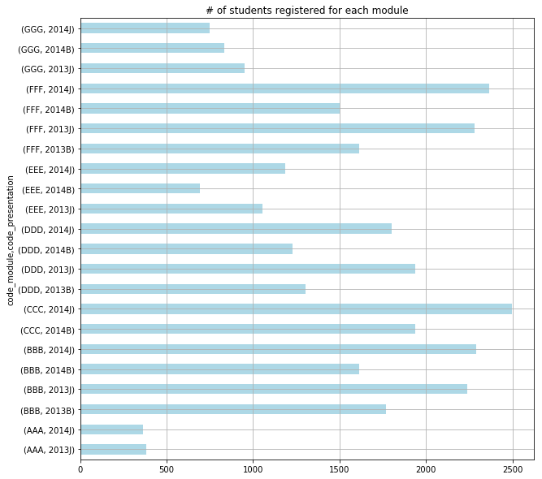

<h2> Open University Learning Analytics </h2>
<h3> Task: Visualising factors associated with the completion of an OU module 
<h3>  Platform: Jupyter Python Notebook </h3>

<h3>1. Loading data and data inspection</h3>


```python
import pandas as pd
import math
import numpy as np
import matplotlib.pyplot as plt

df_studentReg = pd.read_csv("studentRegistration.csv")
df_studentReg.head()
len(df_studentReg)
```


    32593


```python
df_studentInfo = pd.read_csv("studentInfo.csv")
len(df_studentInfo)
```


    32593


```python
df_studentAssessment = pd.read_csv("studentAssessment.csv")
len(df_studentAssessment)
```


    173912


```python
print(df_studentAssessment.columns)
len(df_studentAssessment.groupby(['id_student']))
```

    Index([u'id_assessment', u'id_student', u'date_submitted', u'is_banked',
           u'score'],
          dtype='object')
    


    23369


```python
df_studentVle = pd.read_csv("studentVle.csv")
df_studentVle.columns
len(df_studentVle)
```


    10655280


```python
df_assessment = pd.read_csv("assessments.csv")
df_vle = pd.read_csv("vle.csv")
df_course = pd.read_csv("courses.csv")
df_course.head()
len(df_course)
```


    22


```python
df_course.groupby(['code_module','code_presentation'])['code_presentation'].count()

```


    code_module  code_presentation
    AAA          2013J                1
                 2014J                1
    BBB          2013B                1
                 2013J                1
                 2014B                1
                 2014J                1
    CCC          2014B                1
                 2014J                1
    DDD          2013B                1
                 2013J                1
                 2014B                1
                 2014J                1
    EEE          2013J                1
                 2014B                1
                 2014J                1
    FFF          2013B                1
                 2013J                1
                 2014B                1
                 2014J                1
    GGG          2013J                1
                 2014B                1
                 2014J                1
    Name: code_presentation, dtype: int64


<h3>2. Checking data integrity</h3>


```python
df_studentInfo.groupby(['code_module','code_presentation'])['id_student'].count()
```


    code_module  code_presentation
    AAA          2013J                 383
                 2014J                 365
    BBB          2013B                1767
                 2013J                2237
                 2014B                1613
                 2014J                2292
    CCC          2014B                1936
                 2014J                2498
    DDD          2013B                1303
                 2013J                1938
                 2014B                1228
                 2014J                1803
    EEE          2013J                1052
                 2014B                 694
                 2014J                1188
    FFF          2013B                1614
                 2013J                2283
                 2014B                1500
                 2014J                2365
    GGG          2013J                 952
                 2014B                 833
                 2014J                 749
    Name: id_student, dtype: int64


```python
df_studentReg.groupby(['code_module','code_presentation'])['id_student'].count()
```


    code_module  code_presentation
    AAA          2013J                 383
                 2014J                 365
    BBB          2013B                1767
                 2013J                2237
                 2014B                1613
                 2014J                2292
    CCC          2014B                1936
                 2014J                2498
    DDD          2013B                1303
                 2013J                1938
                 2014B                1228
                 2014J                1803
    EEE          2013J                1052
                 2014B                 694
                 2014J                1188
    FFF          2013B                1614
                 2013J                2283
                 2014B                1500
                 2014J                2365
    GGG          2013J                 952
                 2014B                 833
                 2014J                 749
    Name: id_student, dtype: int64


```python
df_studentVle.groupby(['code_module','code_presentation','id_student'])['id_student'].count()[0:25]
```


    code_module  code_presentation  id_student
    AAA          2013J              11391         196
                                    28400         430
                                    30268          76
                                    31604         663
                                    32885         352
                                    38053         723
                                    45462         355
                                    45642         531
                                    52130         593
                                    53025         904
                                    57506         403
                                    58873         526
                                    59185         345
                                    62155         981
                                    63400         760
                                    65002          54
                                    70464         205
                                    71361         728
                                    74372          72
                                    75091         754
                                    77367         271
                                    91265         496
                                    94961         102
                                    98094         386
                                    100893        243
    Name: id_student, dtype: int64


<h3> 3. Join Data Tables </h3>

<h4>3.1 Join Table "StudentInfo" and "StudentRegistration" by "code_module", "code_presentation", "id_student" </h4>
<p> Observation: each module have 2-4 code presentations, module CCC 2014J has the highest # of students registered</p>


```python
df_mergedInfoReg = pd.merge(df_studentInfo, df_studentReg, how="left", left_on=['code_module', 'code_presentation','id_student'],
                            right_on=['code_module', 'code_presentation','id_student'])
df_mergedInfoReg.head()
```


<div>
<table border="1" class="dataframe">
  <thead>
    <tr style="text-align: right;">
      <th></th>
      <th>code_module</th>
      <th>code_presentation</th>
      <th>id_student</th>
      <th>gender</th>
      <th>region</th>
      <th>highest_education</th>
      <th>imd_band</th>
      <th>age_band</th>
      <th>num_of_prev_attempts</th>
      <th>studied_credits</th>
      <th>disability</th>
      <th>final_result</th>
      <th>date_registration</th>
      <th>date_unregistration</th>
    </tr>
  </thead>
  <tbody>
    <tr>
      <th>0</th>
      <td>AAA</td>
      <td>2013J</td>
      <td>11391</td>
      <td>M</td>
      <td>East Anglian Region</td>
      <td>HE Qualification</td>
      <td>90-100%</td>
      <td>55&lt;=</td>
      <td>0</td>
      <td>240</td>
      <td>N</td>
      <td>Pass</td>
      <td>-159.0</td>
      <td>NaN</td>
    </tr>
    <tr>
      <th>1</th>
      <td>AAA</td>
      <td>2013J</td>
      <td>28400</td>
      <td>F</td>
      <td>Scotland</td>
      <td>HE Qualification</td>
      <td>20-30%</td>
      <td>35-55</td>
      <td>0</td>
      <td>60</td>
      <td>N</td>
      <td>Pass</td>
      <td>-53.0</td>
      <td>NaN</td>
    </tr>
    <tr>
      <th>2</th>
      <td>AAA</td>
      <td>2013J</td>
      <td>30268</td>
      <td>F</td>
      <td>North Western Region</td>
      <td>A Level or Equivalent</td>
      <td>30-40%</td>
      <td>35-55</td>
      <td>0</td>
      <td>60</td>
      <td>Y</td>
      <td>Withdrawn</td>
      <td>-92.0</td>
      <td>12.0</td>
    </tr>
    <tr>
      <th>3</th>
      <td>AAA</td>
      <td>2013J</td>
      <td>31604</td>
      <td>F</td>
      <td>South East Region</td>
      <td>A Level or Equivalent</td>
      <td>50-60%</td>
      <td>35-55</td>
      <td>0</td>
      <td>60</td>
      <td>N</td>
      <td>Pass</td>
      <td>-52.0</td>
      <td>NaN</td>
    </tr>
    <tr>
      <th>4</th>
      <td>AAA</td>
      <td>2013J</td>
      <td>32885</td>
      <td>F</td>
      <td>West Midlands Region</td>
      <td>Lower Than A Level</td>
      <td>50-60%</td>
      <td>0-35</td>
      <td>0</td>
      <td>60</td>
      <td>N</td>
      <td>Pass</td>
      <td>-176.0</td>
      <td>NaN</td>
    </tr>
  </tbody>
</table>
</div>


```python
mergedCount=df_mergedInfoReg.groupby(['code_module','code_presentation'])
mergedCount['id_student'].count()
```


    code_module  code_presentation
    AAA          2013J                 383
                 2014J                 365
    BBB          2013B                1767
                 2013J                2237
                 2014B                1613
                 2014J                2292
    CCC          2014B                1936
                 2014J                2498
    DDD          2013B                1303
                 2013J                1938
                 2014B                1228
                 2014J                1803
    EEE          2013J                1052
                 2014B                 694
                 2014J                1188
    FFF          2013B                1614
                 2013J                2283
                 2014B                1500
                 2014J                2365
    GGG          2013J                 952
                 2014B                 833
                 2014J                 749
    Name: id_student, dtype: int64


```python
%matplotlib inline 
mergedCount['id_student'].size().plot.barh(title='# of students registered for each module',figsize=[10,10], grid=True,color="lightblue")
```


    <matplotlib.axes._subplots.AxesSubplot at 0x37a63358>





 <h4>3.2 Join Table "StudentAssessment" and "Assessment" </h4>
 <p> Observation: each module / presentation involves multiple assessments, most assessments DO NOT have 100% turn in rate. Module DDD has the most # of assessments 14, Module EEE has the least # of assessments 4 </p>


```python
%matplotlib inline
df_mergedStuAss = pd.merge(df_studentAssessment, df_assessment, how="left", left_on=['id_assessment'],
                            right_on=['id_assessment'])
df_mergedStuAss.groupby(['code_module','code_presentation'] ).id_assessment.nunique().plot.barh(
    title='# of assessments for each module', figsize=[8,8], grid=True,color="lightblue")
```


    <matplotlib.axes._subplots.AxesSubplot at 0x40bfa5f8>


```python
ass_count = df_mergedStuAss.groupby(['code_module','code_presentation','id_assessment']).id_assessment.count()
stu_count = df_mergedInfoReg.groupby(['code_module','code_presentation']).id_student.count()

ass_count[0:5]/stu_count[0]

```


    code_module  code_presentation  id_assessment
    AAA          2013J              1752             0.937337
                                    1753             0.892950
                                    1754             0.864230
                                    1755             0.791123
                                    1756             0.778068
    Name: id_assessment, dtype: float64


<h4> 3.3* Merge Table "studentVle" into the merged data frame on studentInfoReg </h4>
<p> Observation: For each module, most student has multiple interactions with the VLE. Module FFF has the most # of average clicks. Module DDD has the least # of average clicks </p>


```python
df_mergedInfoRegVle = pd.merge(df_mergedInfoReg, df_studentVle, 
                               how="left", left_on=['code_module','code_presentation', "id_student"],
                               right_on=['code_module', 'code_presentation',"id_student"])
df_mergedInfoRegVle.head()
```


<div>
<table border="1" class="dataframe">
  <thead>
    <tr style="text-align: right;">
      <th></th>
      <th>code_module</th>
      <th>code_presentation</th>
      <th>id_student</th>
      <th>gender</th>
      <th>region</th>
      <th>highest_education</th>
      <th>imd_band</th>
      <th>age_band</th>
      <th>num_of_prev_attempts</th>
      <th>studied_credits</th>
      <th>disability</th>
      <th>final_result</th>
      <th>date_registration</th>
      <th>date_unregistration</th>
      <th>id_site</th>
      <th>date</th>
      <th>sum_click</th>
    </tr>
  </thead>
  <tbody>
    <tr>
      <th>0</th>
      <td>AAA</td>
      <td>2013J</td>
      <td>11391</td>
      <td>M</td>
      <td>East Anglian Region</td>
      <td>HE Qualification</td>
      <td>90-100%</td>
      <td>55&lt;=</td>
      <td>0</td>
      <td>240</td>
      <td>N</td>
      <td>Pass</td>
      <td>-159.0</td>
      <td>NaN</td>
      <td>546669.0</td>
      <td>-5.0</td>
      <td>16.0</td>
    </tr>
    <tr>
      <th>1</th>
      <td>AAA</td>
      <td>2013J</td>
      <td>11391</td>
      <td>M</td>
      <td>East Anglian Region</td>
      <td>HE Qualification</td>
      <td>90-100%</td>
      <td>55&lt;=</td>
      <td>0</td>
      <td>240</td>
      <td>N</td>
      <td>Pass</td>
      <td>-159.0</td>
      <td>NaN</td>
      <td>546662.0</td>
      <td>-5.0</td>
      <td>44.0</td>
    </tr>
    <tr>
      <th>2</th>
      <td>AAA</td>
      <td>2013J</td>
      <td>11391</td>
      <td>M</td>
      <td>East Anglian Region</td>
      <td>HE Qualification</td>
      <td>90-100%</td>
      <td>55&lt;=</td>
      <td>0</td>
      <td>240</td>
      <td>N</td>
      <td>Pass</td>
      <td>-159.0</td>
      <td>NaN</td>
      <td>546652.0</td>
      <td>-5.0</td>
      <td>1.0</td>
    </tr>
    <tr>
      <th>3</th>
      <td>AAA</td>
      <td>2013J</td>
      <td>11391</td>
      <td>M</td>
      <td>East Anglian Region</td>
      <td>HE Qualification</td>
      <td>90-100%</td>
      <td>55&lt;=</td>
      <td>0</td>
      <td>240</td>
      <td>N</td>
      <td>Pass</td>
      <td>-159.0</td>
      <td>NaN</td>
      <td>546668.0</td>
      <td>-5.0</td>
      <td>2.0</td>
    </tr>
    <tr>
      <th>4</th>
      <td>AAA</td>
      <td>2013J</td>
      <td>11391</td>
      <td>M</td>
      <td>East Anglian Region</td>
      <td>HE Qualification</td>
      <td>90-100%</td>
      <td>55&lt;=</td>
      <td>0</td>
      <td>240</td>
      <td>N</td>
      <td>Pass</td>
      <td>-159.0</td>
      <td>NaN</td>
      <td>546652.0</td>
      <td>-5.0</td>
      <td>1.0</td>
    </tr>
  </tbody>
</table>
</div>


```python
print(df_mergedInfoRegVle.groupby(['code_module','code_presentation','id_student']).id_student.count()[0:10])
df_mergedInfoRegVle.groupby(['code_module','code_presentation']
                           )['sum_click'].mean().plot.barh(
    title='average # of clicks for each module presentation', figsize=[10,10], grid=True,color="lightblue")
```

    code_module  code_presentation  id_student
    AAA          2013J              11391         196
                                    28400         430
                                    30268          76
                                    31604         663
                                    32885         352
                                    38053         723
                                    45462         355
                                    45642         531
                                    52130         593
                                    53025         904
    Name: id_student, dtype: int64
    


    <matplotlib.axes._subplots.AxesSubplot at 0x20f5b630>


<h3> 4. Adding the attribute "completion" to the merged data frame</h3>


```python
df_mergedInfoReg['completion'] = np.isnan(df_mergedInfoReg['date_unregistration'])
df_mergedInfoReg.head()
```


<div>
<table border="1" class="dataframe">
  <thead>
    <tr style="text-align: right;">
      <th></th>
      <th>code_module</th>
      <th>code_presentation</th>
      <th>id_student</th>
      <th>gender</th>
      <th>region</th>
      <th>highest_education</th>
      <th>imd_band</th>
      <th>age_band</th>
      <th>num_of_prev_attempts</th>
      <th>studied_credits</th>
      <th>disability</th>
      <th>final_result</th>
      <th>date_registration</th>
      <th>date_unregistration</th>
      <th>completion</th>
    </tr>
  </thead>
  <tbody>
    <tr>
      <th>0</th>
      <td>AAA</td>
      <td>2013J</td>
      <td>11391</td>
      <td>M</td>
      <td>East Anglian Region</td>
      <td>HE Qualification</td>
      <td>90-100%</td>
      <td>55&lt;=</td>
      <td>0</td>
      <td>240</td>
      <td>N</td>
      <td>Pass</td>
      <td>-159.0</td>
      <td>NaN</td>
      <td>True</td>
    </tr>
    <tr>
      <th>1</th>
      <td>AAA</td>
      <td>2013J</td>
      <td>28400</td>
      <td>F</td>
      <td>Scotland</td>
      <td>HE Qualification</td>
      <td>20-30%</td>
      <td>35-55</td>
      <td>0</td>
      <td>60</td>
      <td>N</td>
      <td>Pass</td>
      <td>-53.0</td>
      <td>NaN</td>
      <td>True</td>
    </tr>
    <tr>
      <th>2</th>
      <td>AAA</td>
      <td>2013J</td>
      <td>30268</td>
      <td>F</td>
      <td>North Western Region</td>
      <td>A Level or Equivalent</td>
      <td>30-40%</td>
      <td>35-55</td>
      <td>0</td>
      <td>60</td>
      <td>Y</td>
      <td>Withdrawn</td>
      <td>-92.0</td>
      <td>12.0</td>
      <td>False</td>
    </tr>
    <tr>
      <th>3</th>
      <td>AAA</td>
      <td>2013J</td>
      <td>31604</td>
      <td>F</td>
      <td>South East Region</td>
      <td>A Level or Equivalent</td>
      <td>50-60%</td>
      <td>35-55</td>
      <td>0</td>
      <td>60</td>
      <td>N</td>
      <td>Pass</td>
      <td>-52.0</td>
      <td>NaN</td>
      <td>True</td>
    </tr>
    <tr>
      <th>4</th>
      <td>AAA</td>
      <td>2013J</td>
      <td>32885</td>
      <td>F</td>
      <td>West Midlands Region</td>
      <td>Lower Than A Level</td>
      <td>50-60%</td>
      <td>0-35</td>
      <td>0</td>
      <td>60</td>
      <td>N</td>
      <td>Pass</td>
      <td>-176.0</td>
      <td>NaN</td>
      <td>True</td>
    </tr>
  </tbody>
</table>
</div>


<h3>5. Select one particular code_module and code_presentation</h3>


```python
%matplotlib inline
fig, axs = plt.subplots(2,2, figsize=[20,20])
mergedCount['id_student'].size().plot.barh(title='# of students registered for each module', grid=True,color="green",ax=axs[0,0])
df_mergedStuAss.groupby(['code_module','code_presentation'] ).id_assessment.nunique().plot.barh(title='# of assessments for each module',  grid=True,color="green",ax=axs[0,1])
df_mergedInfoRegVle.groupby(['code_module','code_presentation'] )['sum_click'].mean().plot.barh(title='average # of clicks for each module presentation', grid=True,color="green",ax=axs[1,0])

Module = 'FFF'
presentation = '2013J'

AGp=df_mergedInfoReg.groupby(['code_module']).get_group(Module)
AGp_all = AGp.groupby(['code_presentation'])
AGp_all.get_group(presentation).groupby('completion').size().plot.pie(title="Module "+Module+"-"+presentation,ax=axs[1,1],autopct='%1.1f%%',
        shadow=True,fontsize=15)
```


    <matplotlib.axes._subplots.AxesSubplot at 0x1bcb2710>


```python
AGp_pr = AGp_all.get_group(presentation)
AGp_pr.head()
```


<div>
<table border="1" class="dataframe">
  <thead>
    <tr style="text-align: right;">
      <th></th>
      <th>code_module</th>
      <th>code_presentation</th>
      <th>id_student</th>
      <th>gender</th>
      <th>region</th>
      <th>highest_education</th>
      <th>imd_band</th>
      <th>age_band</th>
      <th>num_of_prev_attempts</th>
      <th>studied_credits</th>
      <th>disability</th>
      <th>final_result</th>
      <th>date_registration</th>
      <th>date_unregistration</th>
      <th>completion</th>
    </tr>
  </thead>
  <tbody>
    <tr>
      <th>23911</th>
      <td>FFF</td>
      <td>2013J</td>
      <td>26247</td>
      <td>M</td>
      <td>South East Region</td>
      <td>HE Qualification</td>
      <td>80-90%</td>
      <td>35-55</td>
      <td>2</td>
      <td>60</td>
      <td>N</td>
      <td>Fail</td>
      <td>-47.0</td>
      <td>NaN</td>
      <td>True</td>
    </tr>
    <tr>
      <th>23912</th>
      <td>FFF</td>
      <td>2013J</td>
      <td>29335</td>
      <td>M</td>
      <td>West Midlands Region</td>
      <td>Lower Than A Level</td>
      <td>40-50%</td>
      <td>0-35</td>
      <td>0</td>
      <td>60</td>
      <td>N</td>
      <td>Distinction</td>
      <td>-31.0</td>
      <td>NaN</td>
      <td>True</td>
    </tr>
    <tr>
      <th>23913</th>
      <td>FFF</td>
      <td>2013J</td>
      <td>29769</td>
      <td>M</td>
      <td>East Midlands Region</td>
      <td>A Level or Equivalent</td>
      <td>40-50%</td>
      <td>0-35</td>
      <td>1</td>
      <td>60</td>
      <td>N</td>
      <td>Fail</td>
      <td>-32.0</td>
      <td>NaN</td>
      <td>True</td>
    </tr>
    <tr>
      <th>23914</th>
      <td>FFF</td>
      <td>2013J</td>
      <td>32221</td>
      <td>M</td>
      <td>South Region</td>
      <td>A Level or Equivalent</td>
      <td>60-70%</td>
      <td>0-35</td>
      <td>0</td>
      <td>60</td>
      <td>N</td>
      <td>Fail</td>
      <td>-32.0</td>
      <td>NaN</td>
      <td>True</td>
    </tr>
    <tr>
      <th>23915</th>
      <td>FFF</td>
      <td>2013J</td>
      <td>33600</td>
      <td>F</td>
      <td>London Region</td>
      <td>A Level or Equivalent</td>
      <td>40-50%</td>
      <td>35-55</td>
      <td>0</td>
      <td>150</td>
      <td>N</td>
      <td>Withdrawn</td>
      <td>-43.0</td>
      <td>32.0</td>
      <td>False</td>
    </tr>
  </tbody>
</table>
</div>


```python
# #saving to file
# AGp_pr.to_csv('Module_presentation.csv')
```

<h3>6. Visualising categorical variable association -- mosaic plot </h3>


```python
%matplotlib inline
from statsmodels.graphics.mosaicplot import mosaic
fig, axs = plt.subplots(4,2, figsize=[16,32])
[f,d]=mosaic(AGp_pr, ['completion','disability'],statistic=False, gap=0.02, title="disability vs completion",ax=axs[0,0])
[f,d]=mosaic(AGp_pr, ['completion','gender'],statistic=False, gap=0.02, title="gender vs completion" ,ax=axs[0,1])
[f,d]=mosaic(AGp_pr, ['completion','age_band'],statistic=False, gap=0.02, title="age vs completion",ax=axs[1,0])
[f,d]=mosaic(AGp_pr, ['completion','imd_band'],statistic=False, gap=0.02, title="imd_band vs completion",ax=axs[1,1])
[f,d]=mosaic(AGp_pr, ['completion','final_result'],statistic=False, gap=0.02, title="final_result vs completion",ax=axs[2,1])
[f,d]=mosaic(AGp_pr, ['completion','region'],statistic=False, gap=0.02, title="region vs completion",ax=axs[2,0])
[f,d]=mosaic(AGp_pr, ['completion','highest_education'],statistic=False, gap=0.02, title="highest_education vs completion",ax=axs[3,0])
[f,d]=mosaic(AGp_pr, ['completion','num_of_prev_attempts'],statistic=False, gap=0.02, title="previous attempts vs completion",ax=axs[3,1])
```


<h3>7. Calculating categorical variable pair-wise correlation </h3>


```python
from sklearn.preprocessing import LabelEncoder
lb_make = LabelEncoder()
SelectedDF = AGp_pr[['completion','num_of_prev_attempts','gender','highest_education','age_band','disability','final_result','imd_band','region']]
SelectedDF_code = pd.DataFrame(data=SelectedDF)
SelectedDF_code["gender"] = lb_make.fit_transform(SelectedDF["gender"])
SelectedDF_code["highest_education"] = lb_make.fit_transform(SelectedDF["highest_education"])
SelectedDF_code["age_band"] = lb_make.fit_transform(SelectedDF["age_band"])
SelectedDF_code["disability"] = lb_make.fit_transform(SelectedDF["disability"])
SelectedDF_code["final_result"] = lb_make.fit_transform(SelectedDF["final_result"])
SelectedDF_code["imd_band"] = lb_make.fit_transform(SelectedDF["imd_band"])
SelectedDF_code["region"] = lb_make.fit_transform(SelectedDF["region"])
SelectedDF_code["completion"] = lb_make.fit_transform(SelectedDF["completion"])
SelectedDF_code["index"] = SelectedDF_code.index
correlation = dict()
correlation["disability"] = SelectedDF_code["disability"].corr(SelectedDF_code["completion"],method="pearson")
correlation['gender'] = SelectedDF_code["gender"].corr(SelectedDF_code["completion"],method="pearson")
correlation['age_band'] = SelectedDF_code["age_band"].corr(SelectedDF_code["completion"],method="pearson")
correlation['imd_band']= SelectedDF_code["imd_band"].corr(SelectedDF_code["completion"],method="pearson")
correlation['final_result']= SelectedDF_code["final_result"].corr(SelectedDF_code["completion"],method="pearson")
correlation['region']= SelectedDF_code["region"].corr(SelectedDF_code["completion"],method="pearson")
correlation['highest_education']= SelectedDF_code["highest_education"].corr(SelectedDF_code["completion"],method="pearson")
correlation['previous_attempts']= SelectedDF_code["num_of_prev_attempts"].corr(SelectedDF_code["completion"],method="pearson")
print(correlation)
fig = plt.figure(figsize=[20,8])
plt.bar(range(len(correlation)), correlation.values(), align='center')
a=plt.xticks(range(len(correlation)), correlation.keys())
plt.grid()
```

    {'imd_band': 0.037596138571477138, 'final_result': -0.76819161744414777, 'highest_education': -0.074114296142351321, 'age_band': -0.0064517671941442603, 'gender': 0.025793658483770691, 'region': -0.0061326413060969589, 'disability': -0.07384604787696801, 'previous_attempts': -0.04065501681939724}
    


